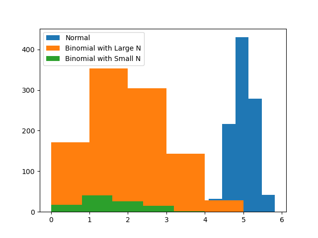

Please see the histogram below.

The dataset of the binomial distribution of the larger dataset is evidently closer to a normal distribution than the binomial distribution of the smaller dataset. This is due to the Central Limit Theorem.

